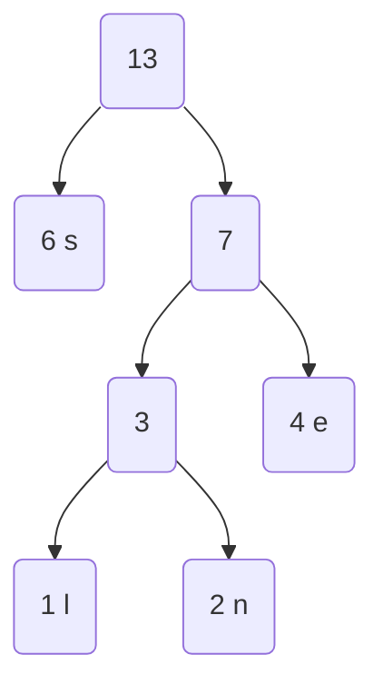

# Huffman Coding

An implementation of the classic Huffman Code written in C, exploring concepts
related to priority queues, trees and encoding/decoding binary representations.
Using $<https://codingchallenges.fyi/challenges/challenge-huffman/> as a guide and
for test input. This is not meant as a general purpose tool, lacking any type of
command line interface nor Unicode support, for example. Rather an exercise in
curiosity and trying out some ideas. Compression is a very interesting field,
something that only gets more important as the amount of data explodes (e.g.,
AI).

## Simple example

Word: senselessness, Length: 13, Character Frequency:

| l | e | n | s |
|---|---|---|---|
| 1 | 4 | 2 | 6 |

These become the leaf nodes, organized into a binary tree weighted by the
frequency. Higher frequency characters are towards the top (root), while less
frequent characters shift to the bottom. This is what gives the Huffman coding
scheme it's power to adaptively compress data. The path in the tree to a
character determines how many bits are required to represent it. The bits define
the path in the binary tree (0 = left, 1 = right).

The algorithm to create the Huffman coding tree is as follows:

1. Organize leaf nodes (typically into a priority queue)
2. If queue has one element remaining, terminate
3. Remove two smallest frequency nodes, create and connect to internal node
   weighted by sum of the pair. Add this back to the priority queue.
4. Go back to step (2).

The algorithm creates a tree that looks like this:

